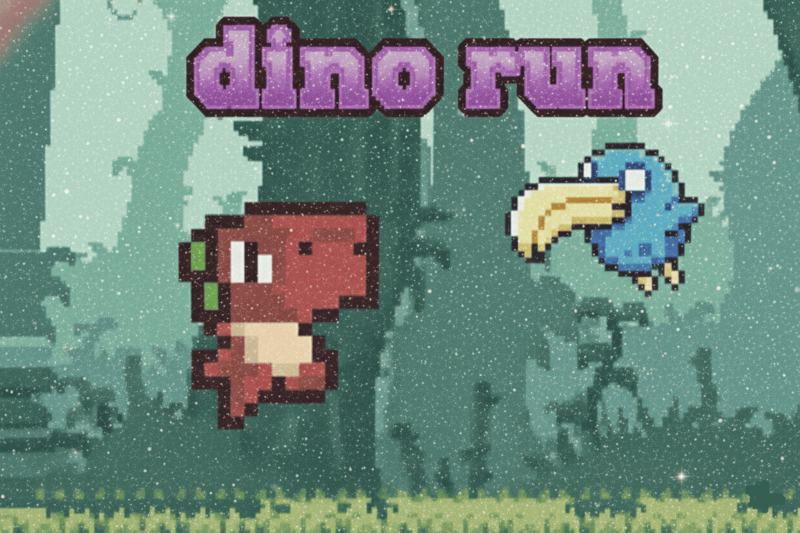

# JogoDinoRun
Nesse jogo feito em GdScript, fiz uma nova versão do clássico Dino Run do Google.

 🦖 Dino Run

Dino Run é um jogo simples e leve, inspirado no dinossauro do Google.

Foi feito com o motor Godot e pensado para rodar bem em qualquer computador.

O objetivo é correr o máximo que puder, desviando dos obstáculos pelo caminho.

Os comandos são básicos e o visual é retrô, lembrando os jogos antigos de navegador.

Criei esse projeto com a intenção de aprender, testar ideias e trazer um pouco de nostalgia pra quem jogar.

Espero que você goste e se divirta.

🎮 Controles:

Espaço  → pular

Seta para baixo → abaixar

Você pode baixar o jogo e jogá-lo aqui: https://fernandab.itch.io/dino-run
